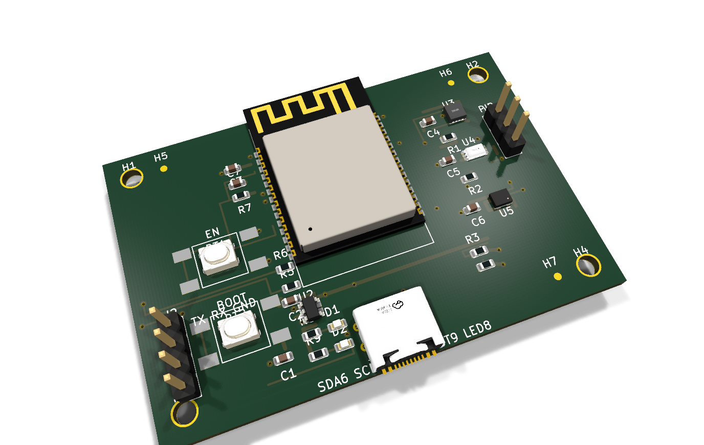
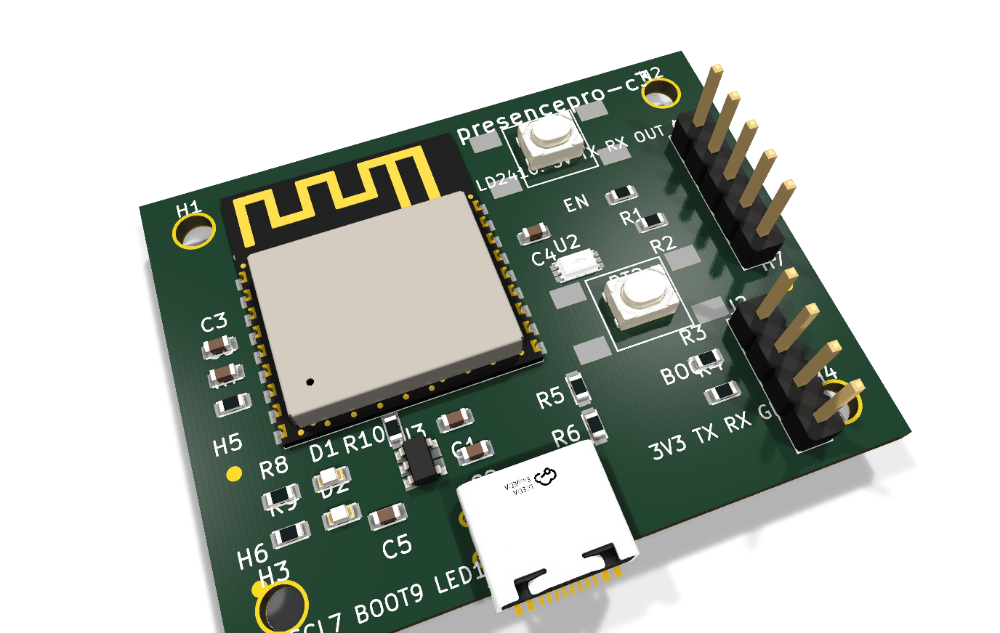
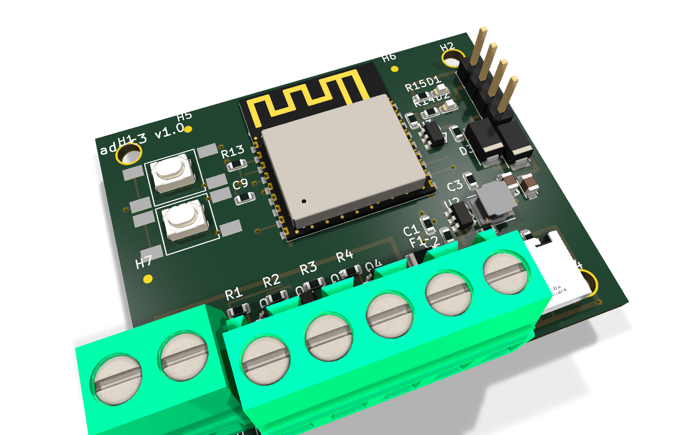
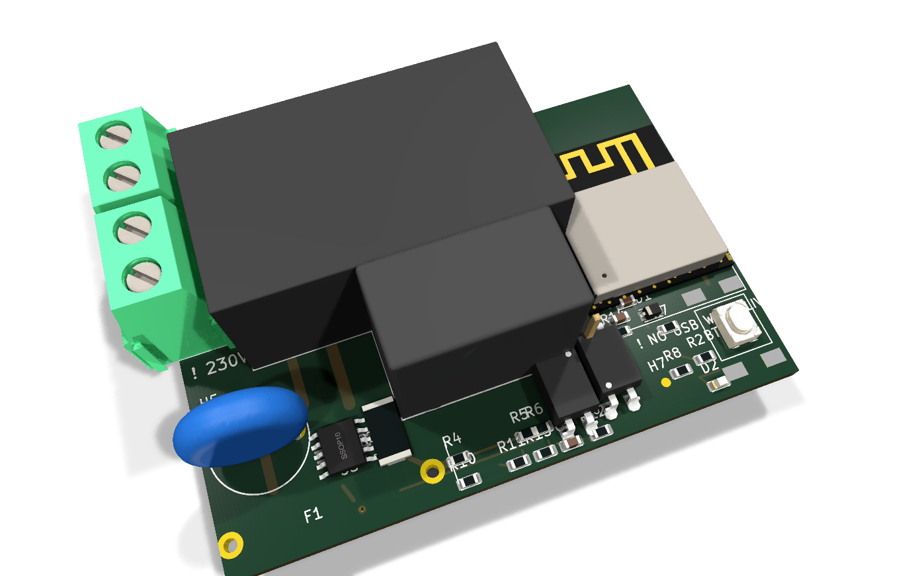
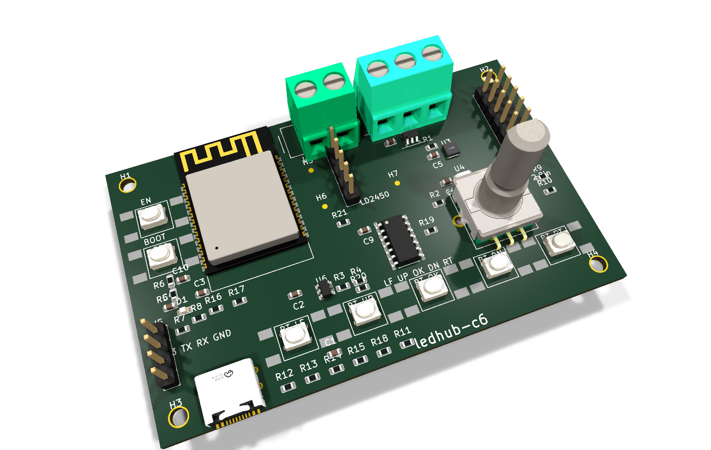
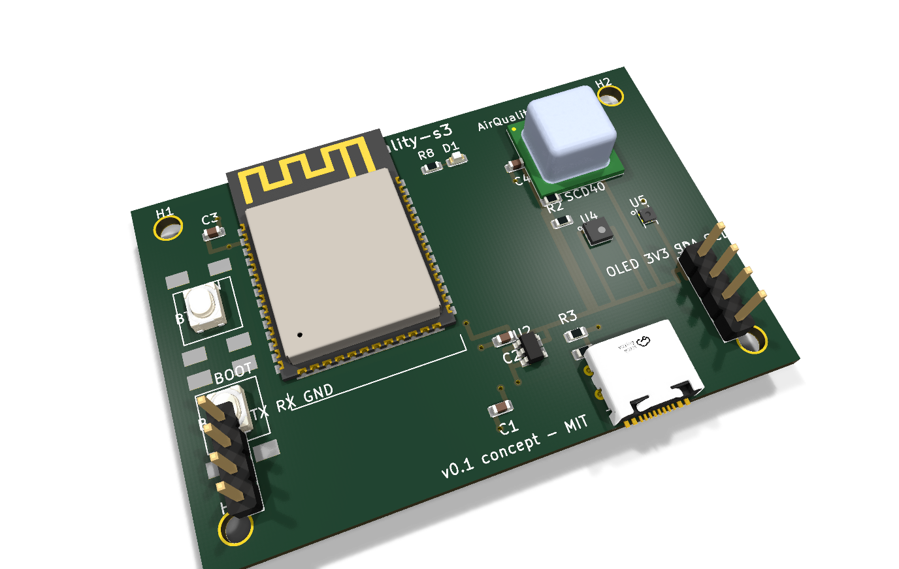
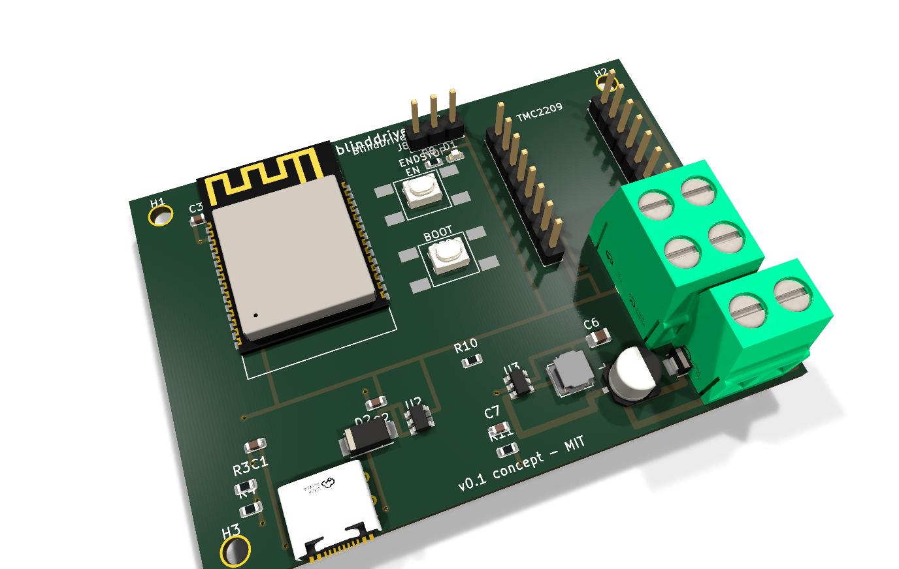
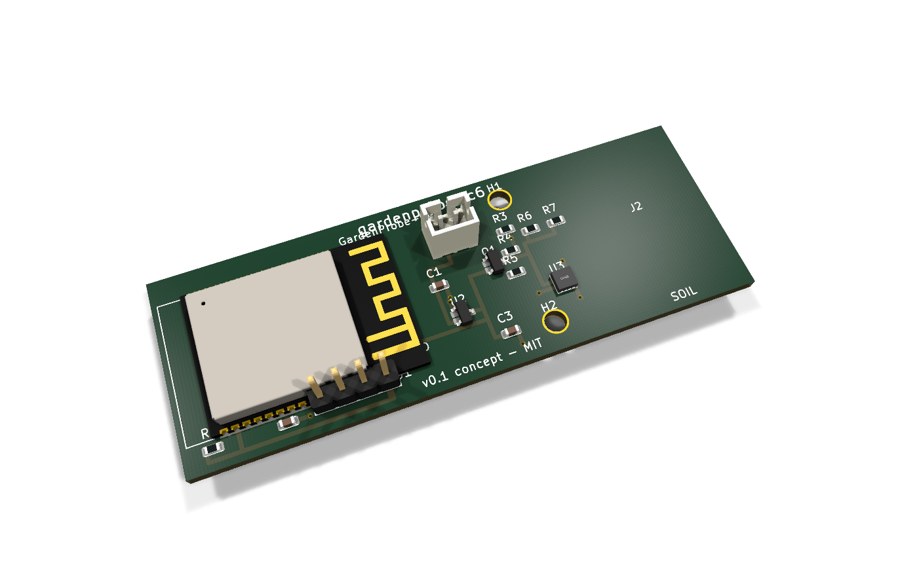

# home-automation-pcbs

Open-hardware IoT boards for home automation, designed for **ESPHome** and/or
**Matter-over-Thread / Zigbee** (ESP32-C3/C6/S3/H2 based). All projects are
native **KiCad 8** and fully self-contained (project-local symbol libraries,
inline custom footprints, generator scripts — every file is reproducible).

> ⚠ **Verify before fabrication.** Footprints for ESP modules and sensors are
> drawn from published datasheets but these boards have not been through a
> physical run. v0.1 boards have signal routing left for autorouting
> (documented per-board). Check each board README before ordering PCBs.
> **RelayMini contains mains voltage — read its safety section first.**

## Boards

| Board | MCU | Ecosystem | Function | Status |
|---|---|---|---|---|
| [`boards/sensenode-c6`](boards/sensenode-c6) | ESP32-C6-WROOM-1 | ESPHome (Wi-Fi) + Matter/Thread | Temp/hum, lux, pressure, PIR | v0.1 routed (power), partial ratsnest |
| [`boards/presencepro-c3`](boards/presencepro-c3) | ESP32-C3-WROOM-02 | ESPHome | HLK-LD2410 mmWave presence + lux | v0.1 |
| [`boards/ledquad-c3`](boards/ledquad-c3) | ESP32-C3-WROOM-02 | ESPHome / WLED | 4-ch 12–24 V PWM LED driver | v0.1 |
| [`boards/relaymini-c3`](boards/relaymini-c3) | ESP32-C3-WROOM-02 | ESPHome | ⚠ Mains switch + BL0942 metering | v0.1, safety gates green |
| [`boards/ledhub-c6`](boards/ledhub-c6) | ESP32-C6-WROOM-1 | WLED / ESPHome | 2.8" TFT all-in-one LED controller | v0.1 (flagship) |
| [`boards/threadnode-h2`](boards/threadnode-h2) | ESP32-H2-MINI-1 | Matter-over-Thread / Zigbee | Battery contact sensor / button | v0.1 concept |
| [`boards/airquality-s3`](boards/airquality-s3) | ESP32-S3-WROOM-1 | ESPHome | CO₂ + VOC + temp/hum + OLED header | v0.1 concept |
| [`boards/blinddriver-c6`](boards/blinddriver-c6) | ESP32-C6-WROOM-1 | ESPHome / Matter | TMC2209 roller-blind controller | v0.1 concept |
| [`boards/irblaster-c3`](boards/irblaster-c3) | ESP32-C3-WROOM-02 | ESPHome | IR TX/RX climate bridge | v0.1 concept |
| [`boards/gardenprobe-c6`](boards/gardenprobe-c6) | ESP32-C6-WROOM-1 | ESPHome / Matter | Battery soil-moisture probe | v0.1 concept |
| [`boards/threadrcp-h2`](boards/threadrcp-h2) | ESP32-H2-MINI-1 | OpenThread RCP / Zigbee NCP | Border-router USB dongle | v0.1 concept |

Each board folder contains: `*.kicad_pro/.kicad_sch/.kicad_pcb`, project-local
symbol library, `bom_lcsc.csv` (real, in-stock LCSC part numbers), `README.md`
(BOM, pinout, flashing, analyzer notes), `esphome/*.yaml`, render PNGs, and the
generator script (`gen_*.py`).

## Board showcase

### 🌡️ [SenseNode C6](boards/sensenode-c6) — environmental multisensor

One-per-room environmental node. ESP32-C6 gives you Wi-Fi 6 + BLE5 **and**
802.15.4, so the same SKU can run ESPHome today and Matter-over-Thread tomorrow.

- **Sensors:** SHT31 (temp/hum), BH1750 (lux), BMP280 (pressure), AM312 PIR (motion)
- **Power:** USB-C 5 V → AP2112K-3.3 LDO; EN/BOOT buttons; 1×4 prog header
- **Key parts:** ESP32-C6-WROOM-1, SHT31-AD1B, BH1750FVI, BMP280, AP2112K-3.3, USB-C 16P
- **Firmware:** `boards/sensenode-c6/esphome/sensenode-c6.yaml` (+ esp-matter note)

| Function | ESP32-C6 GPIO |
|---|---|
| I2C SDA / SCL (SHT31 + BH1750 + BMP280) | 6 / 7 |
| PIR OUT (J1) | 4 |
| Status LED (active low) | 8 |
| BOOT button | 9 |
| USB D− / D+ | 12 / 13 |
| UART0 TX0 / RX0 (prog header) | 16 / 17 |
| EN reset | EN |

---

### 🚶 [PresencePro C3](boards/presencepro-c3) — mmWave presence + lux

True still-presence detection (sitting at a desk, sleeping) where PIR fails,
with lux gating so automations only fire when it's dark.

- **Sensors:** HLK-LD2410(B) 24 GHz mmWave (moving + static targets, configurable
  gates), BH1750 ambient light
- **Power:** USB-C 5 V → AP2112K-3.3; native USB flashing
- **Key parts:** ESP32-C3-WROOM-02, HLK-LD2410B (module on 1×5 header), BH1750FVI, AP2112K
- **Firmware:** `esphome/presencepro-c3.yaml` (native `ld2410` component)

| Function | ESP32-C3 GPIO |
|---|---|
| Radar UART RX / TX | 4 / 5 |
| Radar OUT (occupancy) | 3 |
| I2C SDA / SCL (BH1750) | 6 / 7 |
| USB D− / D+ | 18 / 19 |
| Status LED | 10 |
| BOOT / EN | 9 / EN |
| UART0 RX0 / TX0 (prog) | 20 / 21 |

---

### 💡 [LEDQuad C3](boards/ledquad-c3) — 4-ch 12–24 V PWM LED driver

Analog RGBW strip driver for 12/24 V strips — the classic ESPHome `light.rgbw`
board, sized to hide behind furniture.

- **Outputs:** 4× AO3400A N-MOSFET low-side channels on 5.08 mm screw terminals
- **Power:** 12–24 V in (fused) → AP63205 buck 5 V/2 A → AP2112 3.3 V; USB-C
  programming diode-OR'd with the buck rail
- **Key parts:** ESP32-C3-WROOM-02, AP63205, AP2112K-3.3, 4× AO3400A, SS34, USB-C 16P
- **Firmware:** `esphome/ledquad-c3.yaml` (also WLED-friendly)

| Function | ESP32-C3 GPIO |
|---|---|
| PWM R / G / B / W | 4 / 5 / 6 / 7 |
| Status LED | 10 |
| BOOT button | 9 |
| USB D− / D+ | 18 / 19 |
| UART0 TX0 / RX0 | 21 / 20 |
| EN reset | EN |

---

### 🔌 [RelayMini C3](boards/relaymini-c3) — mains switch + energy metering

> ⚠ **110–240 VAC mains board. Lethal voltages. Qualified builders only —
> read the safety section in its README before anything else.**

Sonoff-Basic-class inline switch, but with proper engineering: fused input,
isolation slot, opto-isolated metering, and a SELV-side programming header.

- **Switching:** HF32F-G relay 10 A/250 VAC, 10 A fuse, MOV, creepage ≥ 6 mm,
  milled isolation slot between mains and SELV domains
- **Metering:** BL0942 (V/A/W/Wh/PF) with PC817 opto-isolated UART
- **Key parts:** ESP32-C3-WROOM-02, HLK-PM01 AC/DC, HF32F-G, BL0942, PC817 ×2
- **Firmware:** `esphome/relaymini-c3.yaml` (`bl0942` component)

| Function | GPIO |
|---|---|
| Relay driver (→ K1 coil) | GPIO6 |
| BL0942 UART RX / TX | GPIO4 / GPIO5 |
| User button (active low) | GPIO9 |
| Status LED (active low) | GPIO8 |
| Prog header (SELV side only!) TX0/RX0 | GPIO21 / GPIO20 |

---

### 🕹️ [LEDHub C6](boards/ledhub-c6) — all-in-one display LED controller (flagship)

A complete addressable-LED control station: status display, physical controls,
presence-aware switching and environmental telemetry, running **WLED** with a
custom usermod (`firmware/wled-usermod-ledhub`).

- **Display/UI:** 2.8" ILI9341 TFT (effect, palette, brightness, IP, RSSI),
  EC11 rotary encoder, 5-way nav buttons on one ADC pin (resistor ladder)
- **Sensors:** SHT31 + BH1750 (I2C), INMP441 I2S mic, LD2450 mmWave radar header
- **Output:** WS2812 data via 74AHCT125 level shifter + 470 Ω; separate 5 V LED
  power terminal
- **Key parts:** ESP32-C6-WROOM-1, 74AHCT125, INMP441, SHT31, BH1750, EC11, AP2112K
- **Firmware:** WLED usermod + `esphome/ledhub-c6.yaml`

| Function | ESP32-C6 GPIO |
|---|---|
| TFT SCK / MOSI / CS / DC / RST / BL | 6 / 7 / 5 / 4 / 1 / 2 |
| Encoder A / B | 15 / 16 |
| Nav button ladder (ADC) | 0 |
| INMP441 I2S SCK / WS / SD | 17 / 18 / 19 |
| I2C SDA / SCL | 20 / 21 |
| LD2450 radar RX / TX | 22 / 23 |
| WS2812 data (→ 74AHCT125) | 3 |
| USB D− / D+ | 12 / 13 |

---

### 🚪 [ThreadNode H2](boards/threadnode-h2) — battery Thread contact/button node

ESP32-H2 = 802.15.4 only, built for deep sleep: a CR2032 door/window sensor or
smart button on a Matter-over-Thread or Zigbee network.

- **Power:** CR2032 direct (no LDO — brown-out note in README); reed-switch
  deep-sleep wakeup
- **Key parts:** ESP32-H2-MINI-1, CR2032 holder, reed/header input, 4.7k I2C pull-ups
- **Firmware:** Matter-over-Thread via esp-matter (note in README)

| Signal | GPIO | Notes |
|---|---|---|
| REED | GPIO3 | reed switch to GND, deep-sleep wakeup |
| I2C SDA / SCL | GPIO12 / GPIO13 | expansion header |
| STAT LED | GPIO8 | pulse only — battery |
| BTN (BOOT) | GPIO9 | user button / ROM bootloader |
| TX0 / RX0 | GPIO24 / GPIO23 | prog header (no USB) |

---

### 🌫️ [AirQuality S3](boards/airquality-s3) — CO₂ / VOC / temp / humidity

Full indoor-air-quality node with photoacoustic CO₂ and metal-oxide VOC on one
I2C bus, plus a header for a 0.96" SSD1306 OLED readout.

- **Sensors:** Sensirion SCD40 (CO₂), SGP40 (VOC index), SHT40 (temp/hum)
- **Key parts:** ESP32-S3-WROOM-1, SCD40, SGP40, SHT40, AP2112K-3.3, USB-C
- **Firmware:** `esphome/airquality-s3.yaml` (`scd4x`, `sgp40`, `sht4x`)

| Signal | GPIO | Notes |
|---|---|---|
| I2C SDA / SCL | GPIO8 / GPIO9 | SCD40 0x62, SGP40 0x59, SHT40 0x44, OLED 0x3C |
| BOOT / RST | GPIO0 / EN | |
| STAT LED | GPIO38 | |
| USB D− / D+ | GPIO19 / GPIO20 | native USB flashing |
| TX0 / RX0 | GPIO43 / GPIO44 | spare UART |

---

### 🪟 [BlindDriver C6](boards/blinddriver-c6) — TMC2209 roller-blind controller

Quiet Trinamic stepper control for roller blinds, with ESPHome `cover`
semantics and Wi-Fi 6 + Thread on tap.

- **Driver:** TMC2209 socket (STEP/DIR/EN/DIAG + 1-wire UART config),
  end-stop header, 12 V VMOT with SS34 reverse-polarity protection
- **Power chain:** 12 V → AP63205 5 V → AP2112 3.3 V
- **Key parts:** ESP32-C6-WROOM-1, TMC2209, AP63205, screw terminals
- **Firmware:** `esphome/blinddriver-c6.yaml` (stepper cover)

| Signal | GPIO | Notes |
|---|---|---|
| STEP / DIR | GPIO4 / GPIO5 | TMC2209 socket |
| TMC_EN / DIAG | GPIO6 / GPIO7 | |
| TMC_UART | GPIO15 | 1-wire PDN_UART config |
| ENDSTOP | GPIO18 | header, pull-up |
| USB D− / D+ | GPIO12 / GPIO13 | |

---

### 📡 [IRBlaster C3](boards/irblaster-c3) — IR climate bridge

Give any dumb IR AC/heater a brain: ESPHome `climate_ir` with transmit and
receive (learn your remote's codes).

- **TX:** 2× TSAL6200 high-power IR LEDs driven by S8050 (GPIO4)
- **RX:** TSOP38238 38 kHz receiver (GPIO5); optional BH1750 lux on I2C
- **Key parts:** ESP32-C3-WROOM-02, TSAL6200 ×2, TSOP38238, S8050, BH1750
- **Firmware:** `esphome/irblaster-c3.yaml` (`remote_transmitter`/`remote_receiver`)

| Signal | GPIO | Notes |
|---|---|---|
| IR_TX | GPIO4 | → S8050 → 2× TSAL6200 |
| IR_RX | GPIO5 | TSOP38238 out |
| I2C SDA / SCL | GPIO6 / GPIO7 | BH1750 0x23 |
| STAT LED / BOOT | GPIO10 / GPIO9 | |
| USB D− / D+ | GPIO18 / GPIO19 | |

---

### 🌱 [GardenProbe C6](boards/gardenprobe-c6) — battery soil-moisture stick

Plant sensor built as a 70 × 25 mm stick: the probe is the PCB — a capacitive
copper area on the bottom tip, corrosion-free versus resistive probes.

- **Sensing:** capacitive fixed-RC probe (GPIO0/1), SHT31 on a load-switched
  rail (AO3401) to save battery, 100k/100k battery divider
- **Power:** 3.7 V LiPo on JST-PH, MCP1700-3302 LDO (charge externally)
- **Key parts:** ESP32-C6-WROOM-1, MCP1700, AO3401, SHT31
- **Firmware:** `esphome/gardenprobe-c6.yaml` (deep sleep)

| Signal | GPIO | Notes |
|---|---|---|
| SOIL_ADC / SOIL_CHG | GPIO0 / GPIO1 | capacitive probe |
| BATT_ADC | GPIO2 | Vbat/2 divider |
| LOAD_EN | GPIO3 | sensor rail load switch |
| I2C SDA / SCL | GPIO20 / GPIO21 | SHT31 0x44 |
| TX0 / RX0 | GPIO16 / GPIO17 | prog header (no USB) |

---

### 🧵 [ThreadRCP H2](boards/threadrcp-h2) — OpenThread border-router dongle

35 × 20 mm USB-C dongle that turns a Home Assistant box into an OpenThread
Border Router — the missing piece for all the H2/C6 Thread boards above.

- **Function:** ESP32-H2 RCP firmware (`esp_ot_br` / ot-rcp), native USB
  transport (GPIO26/27) — no UART bridge chip
- **Layout:** module rotated so the antenna overhangs the board edge
  (metal-free keep-out marked on silk)
- **Key parts:** ESP32-H2-MINI-1, USB-C 16P, AP2112K-3.3
- **Firmware:** Espressif ot_rcp example (flash command in README)

| Signal | GPIO | Notes |
|---|---|---|
| USB D− / D+ | GPIO26 / GPIO27 | RCP transport |
| STAT LED | GPIO8 | |
| BOOT / RST | GPIO9 / EN | |
| TX0 / RX0 | GPIO24 / GPIO23 | spare pads only |

## Firmware

- `boards/*/esphome/*.yaml` — ready-to-adapt ESPHome configs.
- [`firmware/wled-usermod-ledhub`](firmware/wled-usermod-ledhub) — WLED usermod
  for LEDHub: ILI9341 status display, rotary encoder brightness, ADC-ladder
  nav buttons, LD2450 presence switching, SHT31/BH1750 telemetry.

## Part data

- [`datasheets/`](datasheets) — datasheet PDFs for all ICs/modules/connectors
  + `manifest.json` (re-sync: `python3 tools/fetch_datasheets.py`).
- [`3dmodels/`](3dmodels) — STEP + WRL models (EasyEDA/LCSC and KiCad
  packages3D mirror) referenced from every PCB (`${KIPRJMOD}/../../3dmodels/…`)
  + `manifest.json` (re-fetch: `python3 tools/fetch_3d.py`).

> **Note:** binary payloads (datasheet PDFs, STEP/WRL models, render PNGs) are
> not committed to git — they are fully regenerable: `tools/fetch_datasheets.py`,
> `tools/fetch_3d.py` (+ `tools/fix_3d.py`), and `tools/render_pcb.py` rebuild
> everything from the manifests in this repo.

## Tools

- `tools/kicadgen.py` — KiCad 8 s-expression writer + project validator used
  by every board generator (`python3 boards/<b>/gen_<b>.py` regenerates).
- `tools/render_pcb.py` — dependency-free PCB rasterizer (the render PNGs in
  each board folder).
- `tools/render3d.sh` — raytraced 3D renders (`render3d_top/bottom.png` per
  board) via `kicad-cli pcb render --quality high` (KiCad ≥ 9.0; use 10.0.0,
  9.0.9/10.0.1 drop component models in CLI renders — CPU raytracer, no X
  server needed).

## Design rules

2-layer, 1.6 mm, 0.2 mm clearance, 0.25 mm min track, ≥0.5 mm power tracks,
GND pour on B.Cu, antenna keepouts on all RF modules. Every board passes
[kicad-happy](https://github.com/aklofas/kicad-happy) schematic/PCB analysis
with zero cross-net violations (DFM-001 = 0); remaining warnings are triaged
in each board's README.

## Acknowledgements

Validation and datasheet tooling: [kicad-happy](https://github.com/aklofas/kicad-happy)
(MIT, © 2025 Andrew Klofas). 3D models: EasyEDA/LCSC and the KiCad official
packages3D libraries. ESP module footprints verified against
[espressif/kicad-libraries](https://github.com/espressif/kicad-libraries).

## License

MIT — see [LICENSE](LICENSE).
