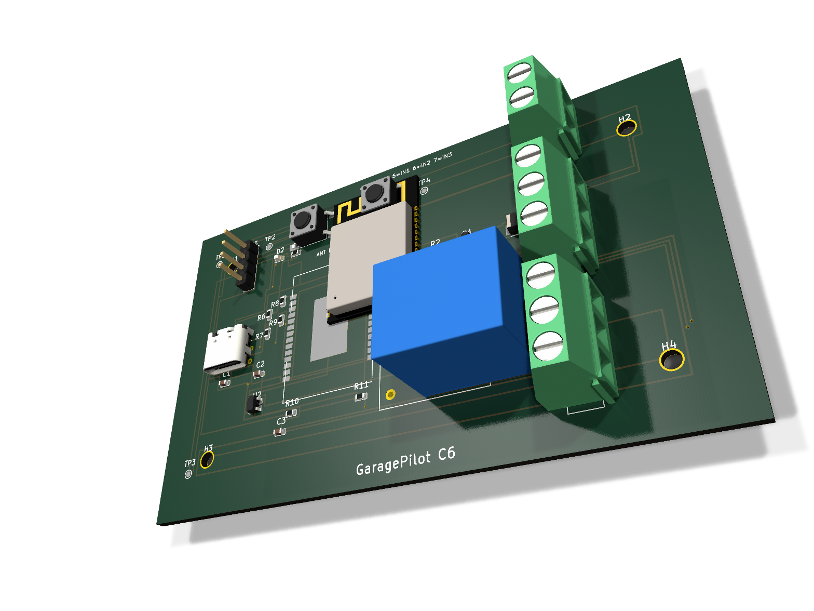
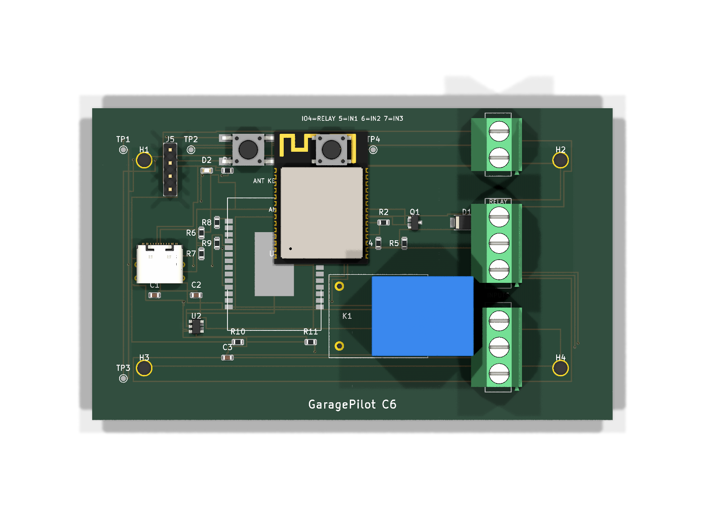
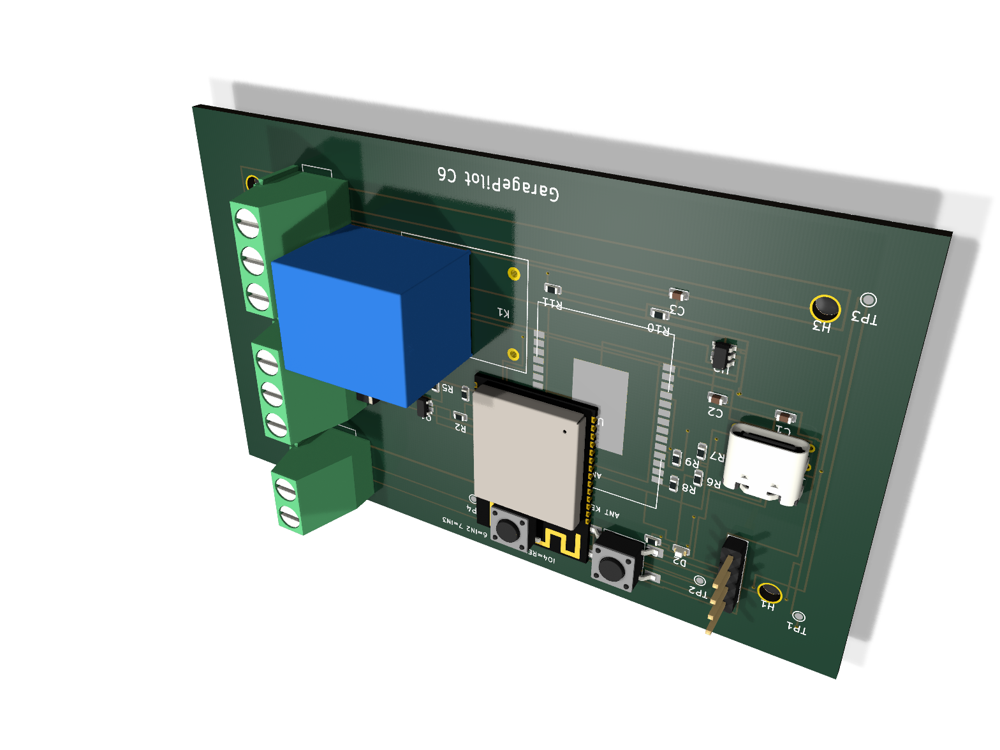

# GaragePilot C6 — ESP32-C6 garage-door controller







A compact, low-voltage garage-door opener controller built around the **ESP32-C6-WROOM-1** module.
The board provides a single dry relay contact for the opener's momentary-button circuit,
three isolated/digital inputs for door-closed / door-open reed switches and a safety beam,
USB-C power and programming, and a 5 V auxiliary screw terminal.
It is designed for **ESPHome** (and can be adapted for Matter-over-Thread later because the
C6 includes an 802.15.4 radio).

> **Status: v0.1 prototype — not production-ready.**
> The board has been placed, autorouted, and visually inspected, but KiCad DRC still reports
> 96 clearance violations and 23 unconnected items (see Validation below).  Do not order panels
> without first resolving these.

## What it does

* Closes a **dry SPDT relay contact** across the garage-door opener's wall-button terminals
  (`COM` / `NO`) for a configurable pulse (typically 250 ms).
* Reads **three active-low digital inputs** with onboard 10 kΩ pull-ups:
  * `INPUT1` — door-closed reed / limit switch
  * `INPUT2` — door-open reed / limit switch
  * `INPUT3` — safety beam / obstruction sensor
* Powers the logic from **USB-C** or a **5 V auxiliary terminal**, regulated down to 3.3 V.
* Exposes a **1×4 2.54 mm programming header** (3.3 V, TX0, RX0, GND) and a **BOOT** + **RESET**
  tactile button pair for firmware flashing.
* Provides test points for +5 V, +3.3 V, GND, and the relay-driver signal.

## Frozen pin map

| Function | ESP32-C6 GPIO | Net / connector |
|---|---|---|
| Relay driver (active high) | IO4 | `RELAY_DRV` → Q1 → K1 coil |
| Door-closed input (pull-up, active low) | IO5 | `INPUT1` on J3 pin 1 |
| Door-open input (pull-up, active low) | IO6 | `INPUT2` on J3 pin 2 |
| Safety beam input (pull-up, active low) | IO7 | `INPUT3` on J3 pin 3 |
| Status LED (active high) | IO8 | D2 red LED |
| BOOT button | IO9 | SW2 (shared with ROM bootloader) |
| RESET button | EN | SW1 |
| USB D− | IO12 | J1 via 22 Ω series resistor |
| USB D+ | IO13 | J1 via 22 Ω series resistor |
| UART0 TX (prog header) | IO16 | J5 pin 2 |
| UART0 RX (prog header) | IO17 | J5 pin 3 |

## Key parts / BOM summary

Full BOM with LCSC numbers and sourcing URLs is in [`bom_lcsc.csv`](bom_lcsc.csv).

| Designator | Value / MPN | Footprint | Purpose |
|---|---|---|---|
| U1 | ESP32-C6-WROOM-1-N8 | Custom module | MCU + Wi-Fi 6 + BLE + 802.15.4 |
| U2 | AP2112K-3.3TRG1 | SOT-23-5 | 3.3 V / 600 mA LDO |
| Q1 | AO3400A | SOT-23 | Relay-coil low-side N-MOSFET |
| K1 | SRD-05VDC-SL-C | T73 / SRD | 5 V SPDT relay, 10 A contact |
| D1 | SS34 | SMA | Flyback diode for relay coil |
| D2 | LTST-C190KRKT | 0603 red LED | Status LED |
| J1 | TYPE-C-31-M-12 | USB-C 16P mid-mount | USB-C power + flashing |
| J2 | WJ500V-5.08-3P | 3P 5.08 mm screw terminal | Relay COM/NC/NO |
| J3 | WJ500V-5.08-3P | 3P 5.08 mm screw terminal | Inputs 1–3 |
| J4 | WJ500V-5.08-2P | 2P 5.08 mm screw terminal | AUX +5 V / GND |
| J5 | KH-2.54PH180-1X4P-L13.5 | 1×4 2.54 mm header | Programming / UART |
| SW1, SW2 | TS-1187A-B-A-B | 6×6 mm SMD tactile | RESET, BOOT |
| R1, R3–R5, R10–R11 | 10 kΩ 0603 | Pull-ups for LED, inputs, EN, BOOT |
| R2 | 100 Ω 0603 | Gate damping resistor for Q1 |
| R6, R7 | 4.7 kΩ 0603 | USB Type-C CC pulldowns |
| R8, R9 | 22 Ω 0603 | USB D+/D− series resistors |
| C1, C2 | 10 µF 0603 | VBUS and +3V3 bulk |
| C3 | 100 nF 0603 | +3V3 decoupling |

## Design calculations

**LDO power budget (AP2112K-3.3)**

* Maximum dropout at 600 mA: ~350 mV typical; with 5 V input the headroom is comfortable.
* Expected module load: ESP32-C6 peak TX current ≈ 400 mA at 3.3 V (from Espressif datasheet).
  The LDO is rated 600 mA and is sized with modest margin; keep USB-C / 5 V source resistance low.
* LDO power dissipation at peak: `(5 V − 3.3 V) × 0.4 A ≈ 0.68 W`.  The SOT-23-5 thermal pad is
  small, so continuous high-current TX should be thermally validated on the prototype.

**Relay coil drive**

* SRD-05VDC-SL-C coil: ≈ 70 Ω → coil current `5 V / 70 Ω ≈ 71 mA`.
* AO3400A Rds(on) at Vgs = 3.3 V: ≈ 25 mΩ typical.  MOSFET dissipation is negligible.
* Flyback diode D1 (SS34, 3 A / 40 V) provides a safe recirculation path.
* Gate resistor R2 (100 Ω) limits ringing without noticeably slowing the 250 ms pulse.

**USB-C CC detection**

* R6 / R7 = 4.7 kΩ each pull CC1 / CC2 to GND, telling a Type-C source to supply 5 V at
  default current.  These are placed near the connector.

**Input pull-ups**

* R3/R4/R5 = 10 kΩ.  With a reed switch to GND, input current is `3.3 V / 10 kΩ = 0.33 mA`.
  This is a good compromise between noise immunity and battery-friendliness if the auxiliary
  supply is modest.

## Fabrication notes

* **Layers:** 2-layer, 1.6 mm, 1 oz copper, ENIG or lead-free HASL.
* **Clearances:** design rules are 0.2 mm track/clearance, 0.6 mm via / 0.3 mm drill.
  The autorouter was configured with 0.25 mm clearance to improve yield.
* **RF keepout:** the ESP32-C6-WROOM-1 PCB antenna sits at the **bottom** of the module.
  A copper keepout zone forbids tracks, vias, pours, and copper polygons underneath it on all
  copper layers.  Do not place tall metal components or traces in this area.
* **Mounting:** four M2.5 non-plated mounting holes, inset 10 mm from board edges on a
  100 mm × 60 mm board.
* **Programming:** hold BOOT (SW2) while pressing RESET (SW1), or use the `esphome` USB
  upload workflow once the initial flash is complete.
* **5 V auxiliary terminal (J4):** provides a convenient way to power the board from an
  existing 5 V supply inside the opener enclosure.  USB-C and J4 are diode-less, so do not
  connect both at the same time unless both sources are safely OR'd externally.
* **Relay terminals (J2):** dry contact only — these carry the low-voltage momentary-button
  circuit from the opener, not mains voltage.  Verify your opener's control voltage stays
  within the relay/contact rating (10 A / 30 VDC / 125 VAC max per SRD datasheet).

## Firmware

A starter ESPHome configuration is provided in
[`esphome/garagepilot-c6.yaml`](esphome/garagepilot-c6.yaml).
It exposes:

* a `cover` entity for the garage door,
* binary sensors for `Door Closed`, `Door Open`, and `Safety Beam`,
* a `Status LED` light,
* a `Restart` button, and
* on-board BOOT button mapped to `cover.toggle`.

Update the `!secret` placeholders before flashing.

## Validation

### Schematic / ERC

KiCad CLI ERC **could not be run**:

```bash
kicad-cli sch erc --format report --output erc_report.rpt garagepilot-c6.kicad_sch
```

Both the native KiCad 8 `.kicad_sch` and a backported KiCad 9 `.kicad_sch` failed to load
with the error `Failed to load schematic` (exit code 3).  This appears to be a KiCad CLI /
generator-version compatibility issue in this workspace, not a missing library file.  ERC
must be performed manually in KiCad's schematic editor until the CLI load failure is resolved.

### PCB / DRC

```bash
cd boards/garagepilot-c6
kicad-cli pcb drc --format report --output routed_drc_report.rpt garagepilot-c6.kicad_pcb
```

Result:

```text
Found 96 DRC violations
Found 23 unconnected items
Found 0 Footprint errors
Found 0 shorting items
Found 0 items not allowed
Found 0 courtyards overlap
Saved DRC Report to routed_drc_report.rpt
```

The remaining issues are:

* **Clearance violations** between autorouted tracks/vias on B.Cu and F.Cu (actual clearances
  down to ~0.075 mm in a few places, below the 0.2 mm rule).
* **Unconnected items** — mostly missing copper connections for VBUS stitching, the relay coil
  path, and a few signal pads that the autorouter did not complete.
* A number of **library footprint mismatch / missing-library warnings**.  These are caused by
  standard KiCad footprints embedded in the board not matching the system's installed KiCad
  library versions, plus the project pinning a non-existent footprint library name.

There are **no shorting items, no courtyard overlaps, and no disallowed items**.
The v0.1 board is therefore documented as routed but **not DRC-clean**.

### 3D models / renders

* All referenced STEP models are present in [`3dmodels/`](3dmodels/) and listed in
  [`3dmodels/MANIFEST.md`](3dmodels/MANIFEST.md) with source URLs, licenses, and SHA-256
  checksums.
* Renders were produced with:

```bash
kicad-cli pcb render -w 1600 -h 1200 --side top --quality high --perspective --rotate=330,330,0 -o images/render3d_top.png garagepilot-c6.kicad_pcb
kicad-cli pcb render -w 1600 -h 1200 --side bottom --quality high --perspective --rotate=210,30,0 -o images/render3d_bottom.png garagepilot-c6.kicad_pcb
kicad-cli pcb render -w 1600 -h 1200 --side top --quality high -o images/render_top.png garagepilot-c6.kicad_pcb
```

The populated SMD models (ESP32 module, relay, USB-C, terminals, passives) are visible in the
renders and were inspected for floating / rotated / badly-scaled geometry.

## Regenerating the project

```bash
python3 boards/garagepilot-c6/gen_garagepilot_c6.py
```

This recreates the project-local symbol library, schematic, and PCB placement.  The copper
is intentionally left unrouted in the generator so the board can be exported to Specctra DSN
and autorouted (see the generator comments for the freeroute pipeline used for v0.1).
