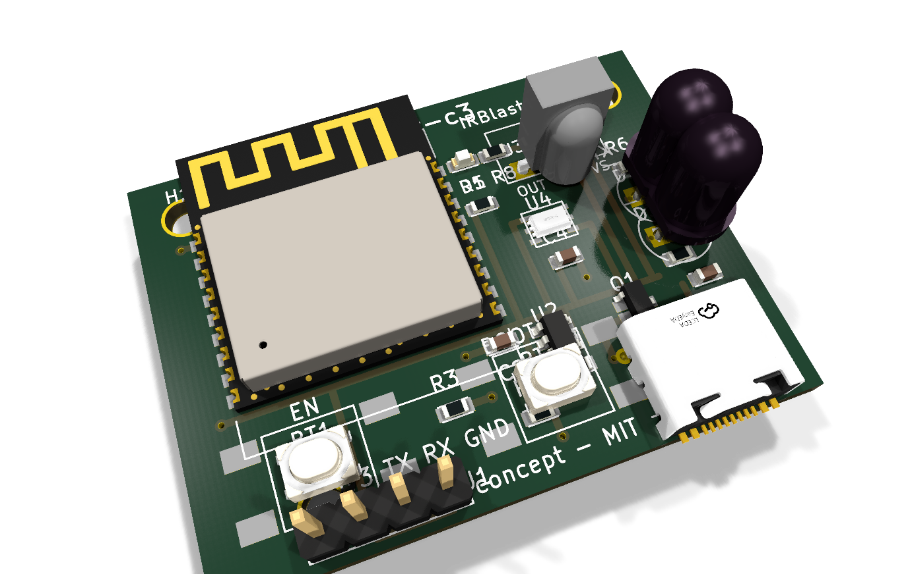
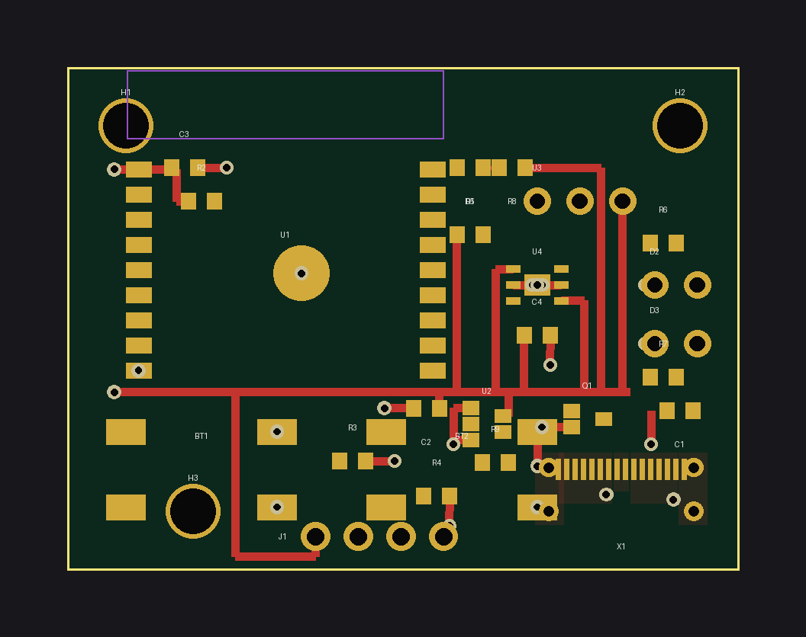
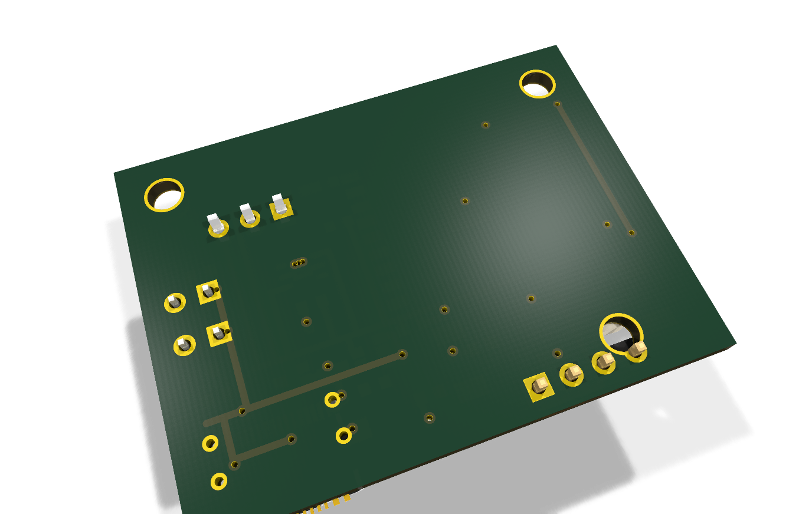
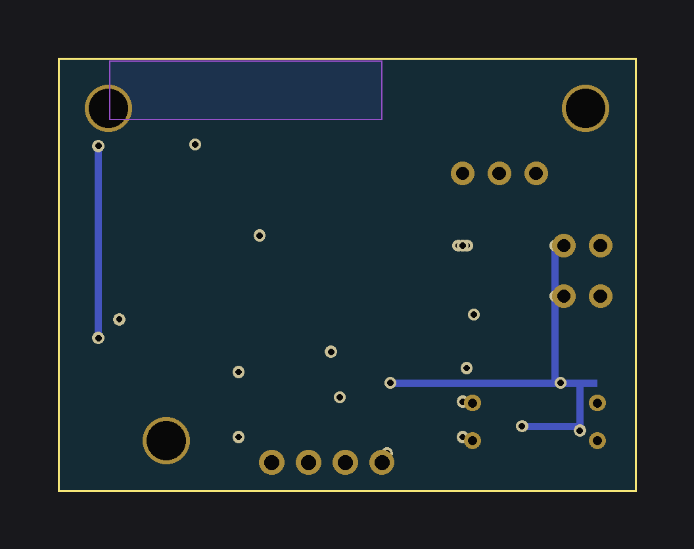

# irblaster-c3 — IR climate bridge (SPEC 7.4)

ESP32-C3-WROOM-02 IR blaster/receiver: 2× TSAL6200 driven by an S8050 from
GPIO4, TSOP38238 receiver on GPIO5, optional BH1750 lux sensor on I2C.
**v0.1 concept board.**

- Board: 45 × 30 mm, 2-layer, 3 mounting holes, USB-C bottom edge
- Status: `python3 boards/wave2/wave2gen.py irblaster-c3` → self-check OK

## BOM (bom_lcsc.csv)

| Ref | Value | Footprint | LCSC # | MPN | Qty |
|---|---|---|---|---|---|
| U1 | ESP32-C3-WROOM-02 | ESP32-C3-WROOM-02 | C2934569 | ESP32-C3-WROOM-02-N4 | 1 |
| U2 | AP2112K-3.3 | SOT-23-5 | C51118 | AP2112K-3.3TRG1 | 1 |
| U3 | TSOP38238 | custom:TSOP382xx | C2916293 | TSOP38238 | 1 |
| U4 | BH1750FVI | custom:BH1750-WSOF6 | C78955 | BH1750FVI-TR | 1 |
| Q1 | S8050 | SOT-23 | C2148 | S8050 | 1 |
| D2,D3 | TSAL6200 IR LEDs | custom:IRLED-5mm | C2895983 | TSAL6200 | 2 |
| D1 | LED red (STAT) | 0603 | C2286 | 17-21SURC/S530-A3/TR8 | 1 |
| X1 | USB-C 16P | custom:USB-C-16P-MidMount | C165948 | TYPE-C-31-M-12 | 1 |
| BT1 | SW_PUSH (BOOT) | custom:Tactile-6x6-SMD | C91808 | TS-1187A-B-A-B | 1 |
| R6,R7 | 47R (IR LED ballast) | 0603 | C23134 | 0603WAF470JT5E | 2 |
| R3,R4 | 5.1k (USB CC) | 0603 | C23186 | 0603WAF5101T5E | 2 |
| R5 | 4.7k (RX pull-up) | 0603 | C23162 | 0603WAF4701T5E | 1 |
| R2,R8 | 1k | 0603 | C21190 | 0603WAF1001T5E | 2 |
| R9 | 100R (Q1 base) | 0603 | C22775 | 0603WAF1000T5E | 1 |
| R1 | 10k (EN) | 0603 | C98252 | 0603WAF1002T5E | 1 |
| C1–C4 | 100nF | 0603 | C14663 | CL10B104KB8NNNC | 4 |
| C5 | 10uF | 0805 | C15850 | CL21A106KPFNNNE | 1 |
| J1 | Conn_01x04 (3V3/TX0/RX0/GND) | PinHeader_1x04_P2.54mm | C49241 | A2541WV-4P | 1 |

## Pinout (C3-WROOM-02)

| Signal | GPIO | Notes |
|---|---|---|
| IR_TX | GPIO4 | R9 100R → Q1 S8050 → D2/D3 (R6/R7 47R) |
| IR_RX | GPIO5 | U3 TSOP38238 out, R5 4.7k pull-up, C4 100nF |
| I2C_SDA / I2C_SCL | GPIO6 / GPIO7 | U4 BH1750 (0x23) |
| STAT_LED | GPIO10 | D1 via R8 |
| BOOT | GPIO9 | BT1 |
| USB D- / D+ | GPIO18 / GPIO19 | native USB-Serial-JTAG |
| TX0 / RX0 | GPIO21 / GPIO20 | J1 prog header |

## Firmware

See `esphome/irblaster-c3.yaml` — remote_transmitter (GPIO4, 50% carrier),
remote_receiver (GPIO5), bh1750 sensor, climate_ir example stub.

## Routing status

**v0.1 concept — signals left for autorouting.** Power rails routed
(VBUS/+3V3/GND + stitching); IR_TX/IR_RX/I2C/USB signals unrouted.

## Analyzer notes

`analyze_pcb.py`: **DFM-001 = 0**. RT-001 unrouted errors expected.
BH1750 WSOF6 footprint uses 0.95 mm pitch (was fixed from 0.5 mm draft).

## Caveats (verify before fabrication!)

- IR LED current: 47R ballasts give ~40–60 mA pulse per LED from 5 V —
  check S8050 SOA and duty cycle for long NEC bursts; reduce if needed.
- TSOP38238 supply filter (R/C per datasheet) recommended before fab.
- **Verify all footprints, pin numbers, and clearances against KiCad
  libraries + datasheets before ordering boards.**

## Renders

| Raytraced 3D (KiCad) | 2D layout |
|---|---|
|  |  |
|  |  |

🎬 [360° turntable video](turntable.mp4) — 24 real KiCad raytraced frames stitched with ffmpeg (tools/turntable.sh).
