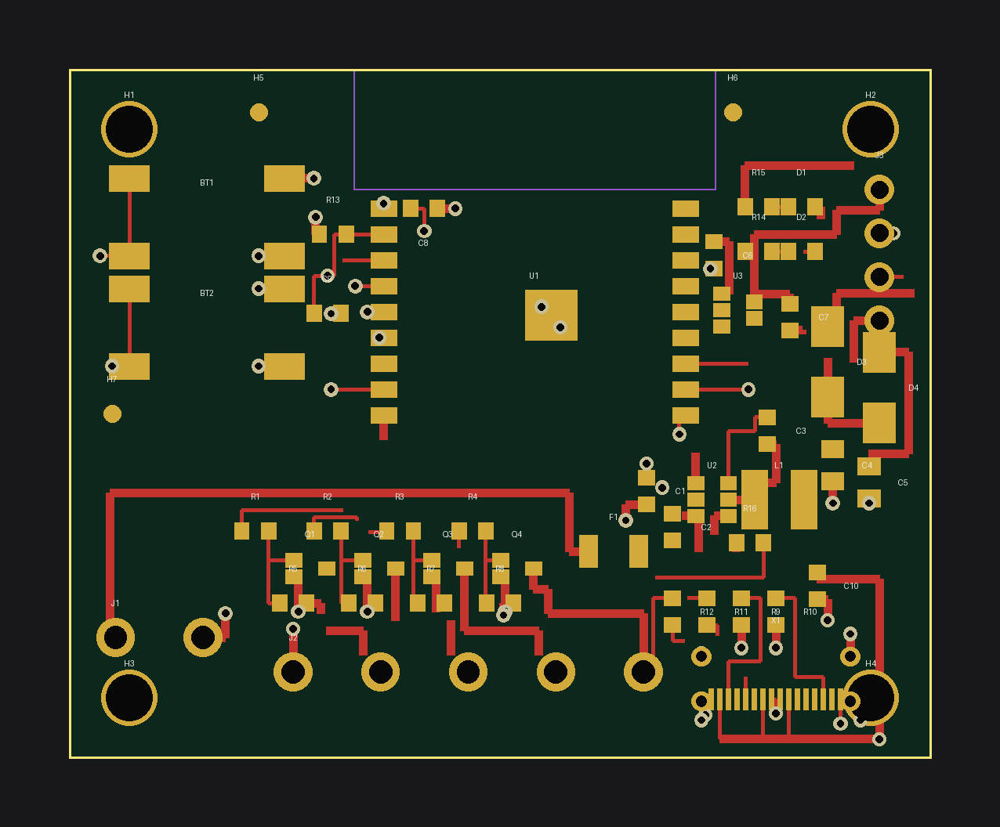
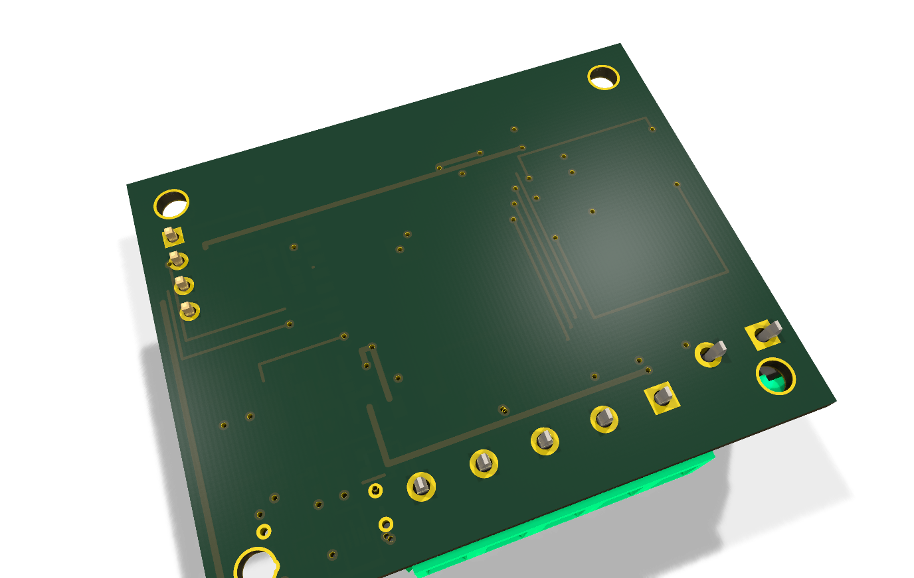
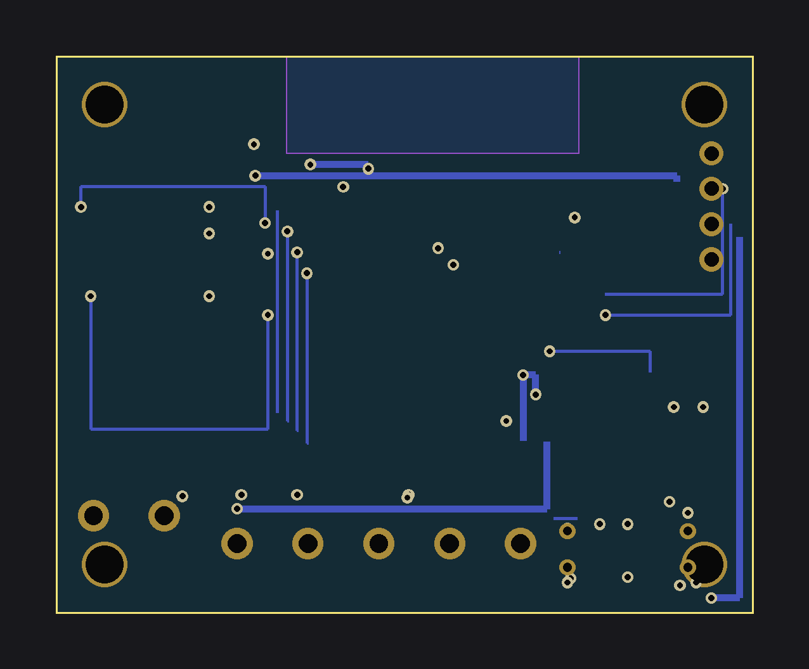

# ledquad-c3 — 4-ch 12–24 V PWM LED strip driver (50 × 40 mm)

ESP32-C3-WROOM-02 based 4-channel (RGBW) low-side PWM LED strip driver.
12–24 V in on J1 (5.08 mm screw terminal, fused), AP63205 buck → +5V/2 A,
AP2112K-3.3 LDO → +3V3 logic, 4× AO3400A N-MOSFET output stages, USB-C
programming with SS34 diode-OR between VBUS and the buck 5 V rail.

License: MIT. KiCad 8 project, generated by `gen_ledquad_c3.py`
(`python3 gen_ledquad_c3.py`; exits non-zero on any validation problem).

## Features

- 4× PWM channels, 12–24 V strips: R=GPIO4, G=GPIO5, B=GPIO6, W=GPIO7,
  100 Ω gate resistors + 10 kΩ pull-downs, low-side AO3400A (SOT-23)
- J1: 2-pin 5.08 mm terminal, 12–24 V in; F1 5 A fuse (1206)
- U2 AP63205 buck, fixed 5 V / 2 A (L1 4.7 µH, Cin 10 µF, Cout 2×22 µF,
  BST 100 nF — datasheet typical circuit;
  https://www.diodes.com/assets/Datasheets/AP63205.pdf)
- U3 AP2112K-3.3 LDO for logic
- X1 USB-C 16P programming (5.1 kΩ CC, D+/D− → GPIO19/18 via 22 Ω);
  VBUS diode-OR'd with buck 5 V via D3/D4 (SS34, D_SMA)
- J2: 5-pin 5.08 mm terminal: V+, R, G, B, W (strip connection)
- J3: 1×4 prog header (+3V3 / TX0=GPIO21 / RX0=GPIO20 / GND)
- BT1 EN reset, BT2 BOOT (GPIO9); D1 power LED, D2 status LED (GPIO10)
- Antenna keepout (no copper, all layers), 3 assembly fiducials,
  GND pour on B.Cu

WLED-compatible pin header: J2's V+/R/G/B/W pinout matches common RGBW
screw-terminal strips; the pin map (GPIO4–7) is usable from WLED builds
with a custom LED output config.

## Pinout

| Function | ESP32-C3 GPIO |
|---|---|
| PWM R / G / B / W | 4 / 5 / 6 / 7 |
| Status LED D2 | 10 |
| BOOT button BT2 | 9 |
| USB D− / D+ | 18 / 19 |
| UART0 TX0 / RX0 (J3) | 21 / 20 |
| EN reset BT1 | EN |

J1: pin 1 = VIN (12–24 V +), pin 2 = GND.
J2: pin 1 = V+ (VIN), pins 2–5 = R/G/B/W (switched low side).
J3: pin 1 = +3V3, pin 2 = TX0 (GPIO21), pin 3 = RX0 (GPIO20), pin 4 = GND.

## BOM

See `bom_lcsc.csv` (machine-readable, grouped by part type).

| Ref | Value | Footprint | LCSC | MPN | Qty |
|---|---|---|---|---|---|
| U1 | ESP32-C3-WROOM-02 | custom | C2934560 | ESP32-C3-WROOM-02-N4 | 1 |
| X1 | USB-C 16P | USB_C_Receptacle_USB2.0_16P | C165948 | TYPE-C-31-M-12 | 1 |
| U2 | AP63205 buck 5V/2A | SOT-23-6 | C2071056 | AP63205WU-7 | 1 |
| U3 | AP2112K-3.3 LDO | SOT-23-5 | C51115 | AP2112K-3.3TRG1 | 1 |
| Q1–Q4 | AO3400A N-MOSFET | SOT-23 | C20917 | AO3400A | 4 |
| D3, D4 | SS34 Schottky | D_SMA | C8678 | SS34 | 2 |
| F1 | Fuse 5 A | 1206 | C136351 | JFC1206-1500FS | 1 |
| L1 | 4.7 µH inductor | custom 4×4 | C167874 | FNR4030S4R7MT | 1 |
| J1 | Screw terminal 2P 5.08 | custom | C474952 | KF128-5.08-2P-AA | 1 |
| J2 | Screw terminal 5P 5.08 | custom | C42377750 | WJ500V-5.08-05P-14-00A | 1 |
| J3 | Header 1×4 | 2.54 mm | C49258 | KH-2.54PH180-1X4P-L13.5 | 1 |
| BT1, BT2 | Tactile 6×6 SMD | custom | C139797 | TS-1187A-B-A-B | 2 |
| R1–R4 | 100 Ω | 0603 | C22369795 | RCA03100RFLF | 4 |
| R5–R8, R13 | 10 kΩ | 0603 | C25804 | 0603WAF1002T5E | 5 |
| R9, R10 | 5.1 kΩ | 0603 | C23186 | 0603WAF5101T5E | 2 |
| R11, R12 | 22 Ω | 0603 | C22926 | 0603WAF220JT5E | 2 |
| R14, R15 | 1 kΩ | 0603 | C21190 | 0603WAF1001T5E | 2 |
| R16 | 100 kΩ | 0603 | C25803 | 0603WAF1003T5E | 1 |
| C1, C6, C7, C10 | 10 µF | 0603 | C15849 | CL10A106KP8NNNC | 4 |
| C2, C3, C8, C9 | 100 nF | 0603 | C14663 | 0603B104K500NT | 4 |
| C4, C5 | 22 µF | 0805 | C45783 | CL21A226MAQNNNE | 2 |
| D1 | LED red | 0603 | C2286 | LTST-C190KRKT | 1 |
| D2 | LED green | 0603 | C2297 | LTST-C190KGKT | 1 |

## Flashing

1. USB-C: hold BT2 (BOOT), tap BT1 (EN) → ROM USB-Serial-JTAG bootloader
   (GPIO18/19). Flash with ESPHome / esptool.
2. Or J3 + external 3.3 V UART (TX0=GPIO21, RX0=GPIO20).
3. ESPHome yaml: `esphome/ledquad-c3.yaml`.

## Routing status

Hand-routed by the generator with a geometric copper self-check
(0.15 mm clearance + edge/keepout rules). **Copper objects the self-check
flags are automatically removed**, leaving ratsnest instead of colliding
copper; the log is `analysis/pruned_routes.txt`.

Nets with removed copper (fully/partially unrouted — finish in KiCad before
fabrication): **PWM_R/G/B/W (module→gate-resistor drops), OUT_R/OUT_G
(drain→J2 stubs), +3V3, +5V, 5V_BUCK (partial), VBUS, VIN/VIN_EN
(partial), USB_DM/USB_DP and USB_*_CON, STAT_LED, TX0, RX0, GND (some via
stubs — main GND is the B.Cu pour)**. Power path J1→F1→U2→L1 and the
output stages Q1–Q4→J2 are routed.

## Analyzer notes (kicad-happy)

- `SS-001` (schematic, error): BOM MPN-coverage gate — the analyzer does
  not read `bom_lcsc.csv`; all BOM lines carry LCSC + MPN. Allowed gate.
- `RS-001` (warnings): VIN/VBUS/+5V "no declared source" — these are the
  board input / regulator rails, by design.
- `CG-AUD` (warning): J2 5-pin terminal "no ground pins" — intentional;
  J2 is V+ + 4 switched low-side channels (strip GND returns via V+ lead).
- `PM-001`/`PM-002` (warnings): residual small courtyard overlaps
  (≤ ~1 mm²) around the screw terminals / USB-C and J1 0.6 mm→(fixed to
  ≥1 mm edge distance after rework) — terminal bodies intentionally face
  the board edge; copper self-check passes.
- `TE-001`/`TV-001` (warnings): no test points, limited thermal vias —
  accepted for a prototype.
- DFM-001 cross-net violations: **0**. Cross-analysis: 0 findings.
  `validate_project`: pass.

## Fabrication disclaimer

Prototype design generated programmatically. Custom footprints
(ESP32-C3-WROOM-02, L-4x4-4R7, TB-5.08-2P/5P, tactile 6×6) should be
**verified against manufacturer datasheets before fabrication**. Complete
the unrouted nets listed above in KiCad first. No photos yet — renders
(`render_top.png` / `render_bottom.png`) are machine-generated.

## Renders

| Raytraced 3D (KiCad) | 2D layout |
|---|---|
|  |  |
|  |  |

🎬 [360° turntable video](turntable.mp4) — 24 real KiCad raytraced frames stitched with ffmpeg (tools/turntable.sh).
