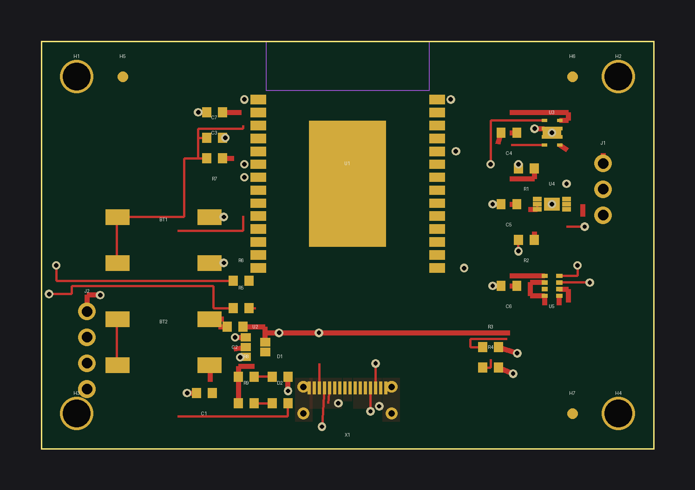
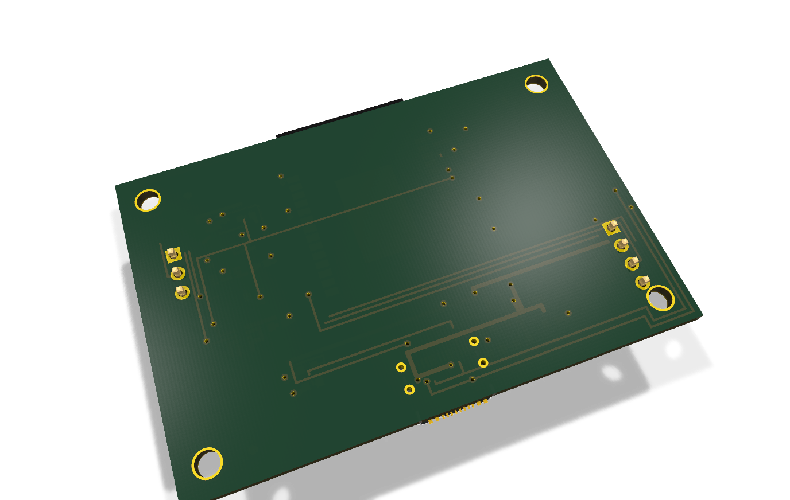
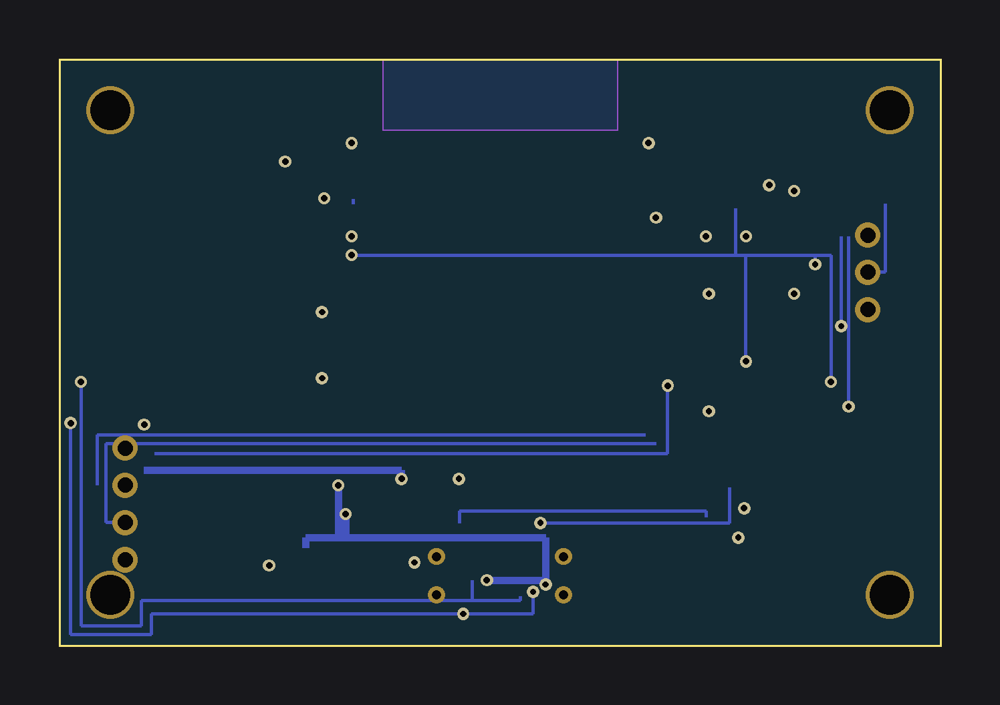

# sensenode-c6 — ESP32-C6 environmental multisensor (60 × 40 mm)

ESP32-C6-WROOM-1 based environmental sensor node: SHT31 (temp/humidity),
BH1750 (lux), BMP280 (pressure) on I2C, AM312 PIR header, USB-C power +
native USB-Serial-JTAG flashing, EN/BOOT buttons, power + status LEDs.

License: MIT. KiCad 8 project, generated by `gen_sensenode_c6.py`
(`python3 gen_sensenode_c6.py`; exits non-zero on any validation problem).

## Features

- ESP32-C6-WROOM-1 (Wi-Fi 6 + 802.15.4 + BLE5) — ESPHome (Wi-Fi) **and**
  Matter-over-Thread / Zigbee capable
- USB-C 2.0: VBUS power, 5.1 kΩ CC pull-downs, D+/D− → GPIO13/12 via 22 Ω
- AP2112K-3.3 LDO (VBUS → +3V3), 10 µF in/out + 100 nF per IC
- I2C sensors SHT31 / BH1750 / BMP280 (SDA=GPIO6, SCL=GPIO7, 4.7 kΩ pull-ups)
- J1 1×3 header for AM312 PIR (VCC=+3V3, OUT=GPIO4, GND)
- BT1 EN reset (10 kΩ pull-up + 100 nF), BT2 BOOT (GPIO9)
- D1 red power LED (+3V3 via 1 kΩ), D2 green status LED GPIO8 (active low)
- J2 1×4 prog header (+3V3 / TX0=GPIO16 / RX0=GPIO17 / GND)
- Antenna keepout (no copper, all layers) at the module antenna end,
  3 assembly fiducials, GND pour on B.Cu

## Matter-over-Thread / Zigbee note

The C6's 802.15.4 radio supports Matter-over-Thread via the
[esp-matter SDK](https://github.com/espressif/esp-matter) (requires a Thread
border router, e.g. a Home Assistant OTBR or an ESP32-H2 border-router
setup) and Zigbee via esp-zigbee-sdk. The shipped ESPHome config
(`esphome/sensenode-c6.yaml`) uses Wi-Fi; for Thread, build an esp-matter
firmware with the same pin map below.

## Pinout

| Function | ESP32-C6 GPIO |
|---|---|
| I2C SDA / SCL (SHT31 + BH1750 + BMP280) | 6 / 7 |
| PIR OUT (J1) | 4 |
| Status LED D2 (active low) | 8 |
| BOOT button BT2 | 9 |
| USB D− / D+ | 12 / 13 |
| UART0 TX0 / RX0 (prog header J2) | 16 / 17 |
| EN reset BT1 | EN |

J1 (PIR): pin 1 = +3V3, pin 2 = OUT (GPIO4), pin 3 = GND.
J2 (prog): pin 1 = +3V3, pin 2 = TX0 (GPIO16), pin 3 = RX0 (GPIO17), pin 4 = GND.

## BOM

See `bom_lcsc.csv` (machine-readable). LCSC numbers are real orderable parts.

| Ref | Value | Footprint | LCSC | MPN | Qty |
|---|---|---|---|---|---|
| U1 | ESP32-C6-WROOM-1 | custom | C32020546 | ESP32-C6-WROOM-1-N8 | 1 |
| X1 | USB-C 16P receptacle | USB_C_Receptacle_USB2.0_16P | C165948 | TYPE-C-31-M-12 | 1 |
| U2 | AP2112K-3.3 LDO | SOT-23-5 | C51115 | AP2112K-3.3TRG1 | 1 |
| U3 | SHT31 | custom DFN-8 | C194656 | SHT31-DIS-B2.5kS | 1 |
| U4 | BH1750 | custom WSOF-6I | C78960 | BH1750FVI-TR | 1 |
| U5 | BMP280 | custom LGA-8 | C92466 | BMP280 | 1 |
| R1, R2 | 4.7 kΩ | 0603 | C23162 | 0603WAF4701T5E | 2 |
| R3, R4 | 5.1 kΩ | 0603 | C23186 | 0603WAF5101T5E | 2 |
| R5, R6 | 22 Ω | 0603 | C22926 | 0603WAF220JT5E | 2 |
| R7 | 10 kΩ | 0603 | C25804 | 0603WAF1002T5E | 1 |
| R8, R9 | 1 kΩ | 0603 | C21190 | 0603WAF1001T5E | 2 |
| C1, C2 | 10 µF | 0603 | C15849 | CL10A106KP8NNNC | 2 |
| C3–C7 | 100 nF | 0603 | C14663 | 0603B104K500NT | 5 |
| D1 | LED red | 0603 | C2286 | LTST-C190KRKT | 1 |
| D2 | LED green | 0603 | C2297 | LTST-C190KGKT | 1 |
| BT1, BT2 | Tactile 6×6 SMD | custom | C139797 | TS-1187A-B-A-B | 2 |
| J1 | Header 1×3 (PIR) | 2.54 mm | C49257 | KH-2.54PH180-1X3P-L13.5 | 1 |
| J2 | Header 1×4 (prog) | 2.54 mm | C49258 | KH-2.54PH180-1X4P-L13.5 | 1 |

## Flashing

1. USB-C: hold BT2 (BOOT), tap BT1 (EN), release BT2 → ROM bootloader on the
   native USB-Serial-JTAG (GPIO12/13). Flash with `esptool.py` / ESPHome.
2. Or use J2 with an external 3.3 V UART (TX0=GPIO16, RX0=GPIO17).
3. ESPHome yaml: `esphome/sensenode-c6.yaml` (`esphome run` with secrets set).

## Routing status

Two-layer hand-routed layout generated by `gen_sensenode_c6.py`. The
generator runs a geometric copper self-check (0.15 mm clearance, board-edge
and antenna-keepout rules); **any copper object the self-check flags is
automatically removed**, leaving that part of the net as ratsnest rather
than shipping colliding copper. Removed objects are logged to
`analysis/pruned_routes.txt`.

Nets with removed copper (fully or partially unrouted — finish in KiCad
before fabrication): **+3V3 (sensor/header branches), BOOT, EN, GND (some
via stubs — main GND is the B.Cu pour), I2C_SDA, I2C_SCL (partial),
PIR_OUT, STAT_LED, TX0, RX0, USB_CC1, USB_CC2, USB_DM, USB_DP, VBUS
(LDO input stub)**. LED1_A/LED2_A, the USB-C fanout and most module-side
power escapes are routed.

## Analyzer notes (kicad-happy)

- `SS-001` (schematic, error): BOM MPN-coverage gate — the analyzer does not
  read `bom_lcsc.csv`; every BOM line has LCSC + MPN in the CSV/README.
  Allowed gate per project rules.
- `PU-001` (warning): SHT31 ALERT/RESET have no pull-ups — both are unused
  (tied per datasheet: ADDR/ALERT/RESET handling documented on the sheet).
- `RS-001` (warning): VBUS has no declared source — it is the USB-C input
  rail, by design.
- `PM-001` (warning): three courtyard overlaps ≤0.12 mm² (U2/C2, X1/D1,
  X1/D2) — cosmetic courtyard rectangles only; copper self-check passes.
- `TE-001` / `TV-001` (warning): no test points / no thermal vias under the
  module EPAD (single via-in-pad was pruned) — accepted for a hand-soldered
  prototype.
- DFM-001 cross-net violations: **0**. Cross-analysis schematic↔PCB: 0
  findings. `validate_project`: pass.

## Fabrication disclaimer

Prototype design generated programmatically. Custom footprints
(ESP32-C6-WROOM-1, SHT31 DFN-8, BH1750 WSOF-6I, BMP280 LGA-8, tactile)
should be **verified against the manufacturer datasheets before
fabrication**. Unrouted nets listed above must be completed in KiCad.
No photos yet — renders (`render_top.png` / `render_bottom.png`) are
machine-generated.

## Renders

| Raytraced 3D (KiCad) | 2D layout |
|---|---|
|  |  |
|  |  |

🎬 [360° turntable video](turntable.mp4) — 24 real KiCad raytraced frames
stitched with ffmpeg (`tools/turntable.sh`).
