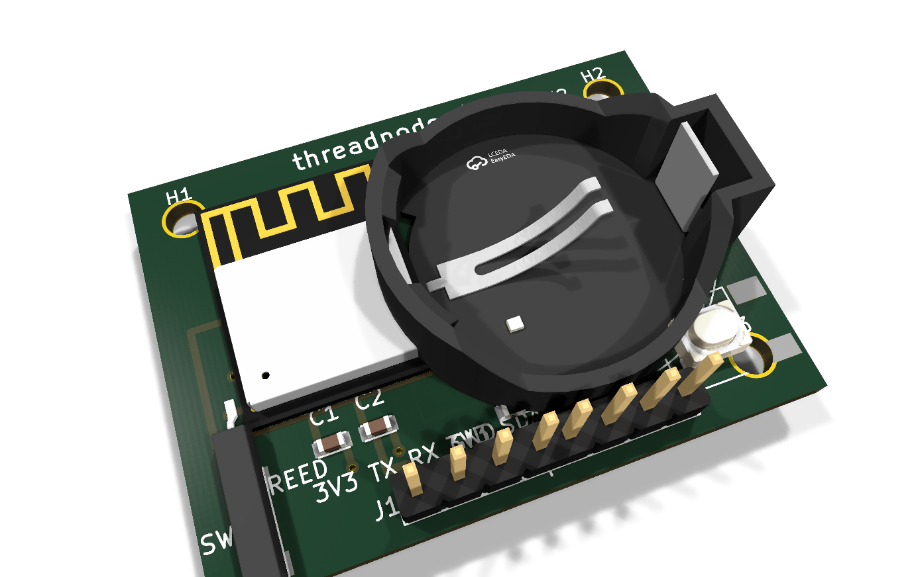
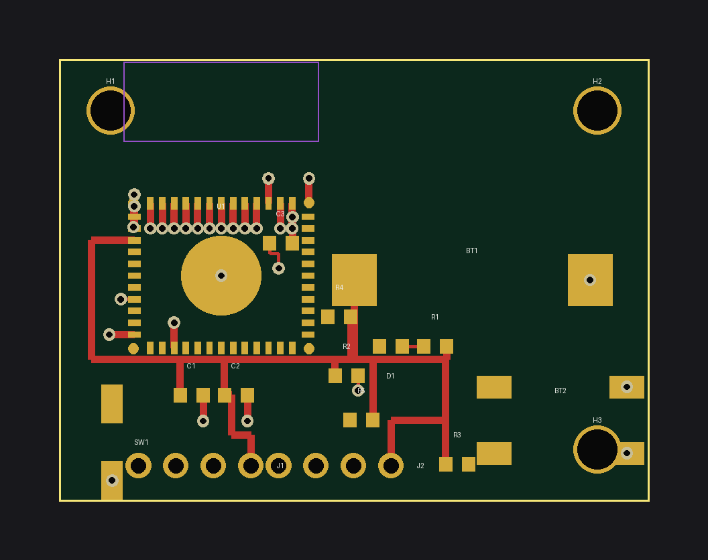
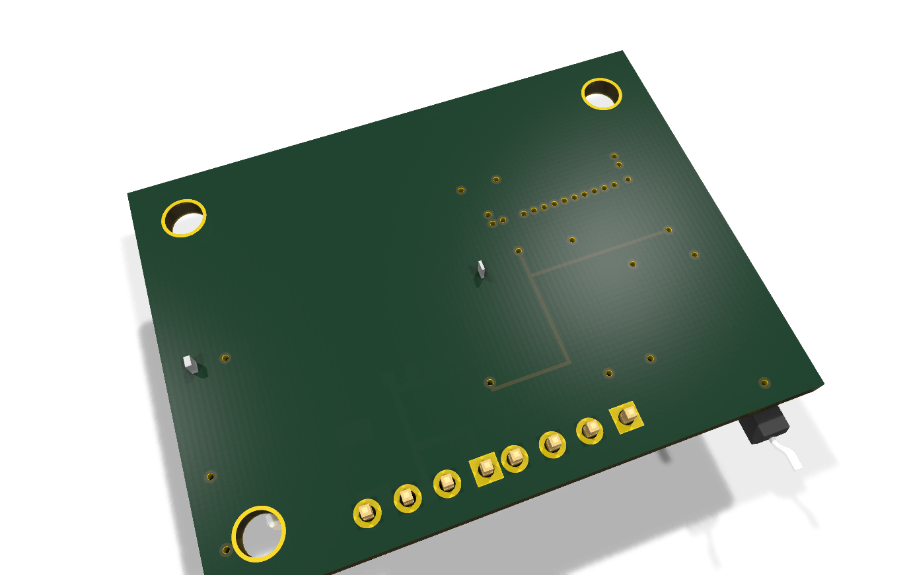
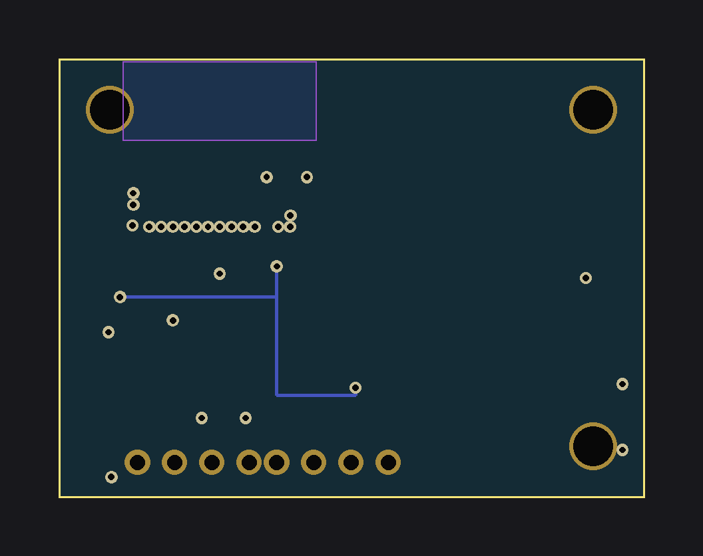

# threadnode-h2 — battery Thread contact/button node (SPEC 7.1)

ESP32-H2-MINI-1 node on CR2032 with reed-switch input, user button, I2C
expansion header, and programming header. **v0.1 concept board.**

- Board: 40 × 30 mm, 2-layer, 3 mounting holes
- Power: CR2032 (BT1) direct to +3V3 (no LDO) — brown-out risk below ~2.6 V
- Status: `python3 boards/wave2/wave2gen.py threadnode-h2` → self-check OK

## BOM (bom_lcsc.csv)

| Ref | Value | Footprint | LCSC # | MPN | Qty |
|---|---|---|---|---|---|
| U1 | ESP32-H2-MINI-1 | ESP32-H2-MINI-1 | C2924539 | ESP32-H2-MINI-1-N4 | 1 |
| BT1 | CR2032 | custom:CR2032-SMD | C70377 | MY-BS-03-A1AJ | 1 |
| SW1 | Reed switch | custom:Reed-MK24 | C140342 | MK24-B-2 | 1 |
| D1 | LED green | 0603 | C72043 | 19-217/GHC-YR1S2/3T | 1 |
| R8 | 1k | 0603 | C21190 | 0603WAF1001T5E | 1 |
| R4,R5 | 4.7k | 0603 | C23162 | 0603WAF4701T5E | 2 |
| R1,R2,R3,R7 | 10k | 0603 | C98252 | 0603WAF1002T5E | 4 |
| C1,C2,C3 | 100nF | 0603 | C14663 | CL10B104KB8NNNC | 3 |
| BT2 | SW_PUSH | custom:Tactile-6x6-SMD | C91808 | TS-1187A-B-A-B | 1 |
| J1 | Conn_01x04 (3V3/TX0/RX0/GND) | PinHeader_1x04_P2.54mm | C49241 | A2541WV-4P | 1 |
| J2 | Conn_01x04 (3V3/SDA/SCL/GND) | PinHeader_1x04_P2.54mm | C49241 | A2541WV-4P | 1 |

## Pinout (H2-MINI-1)

| Signal | GPIO | Notes |
|---|---|---|
| REED | GPIO3 | reed switch to GND, deep-sleep wakeup |
| I2C_SDA / I2C_SCL | GPIO12 / GPIO13 | J2 header, 4.7k pull-ups R4/R5 |
| STAT_LED | GPIO8 | green LED via R8 (pulse only — battery) |
| BTN (BOOT) | GPIO9 | user button; hold at reset = ROM bootloader |
| TX0 / RX0 | GPIO24 / GPIO23 | J1 prog header (flash + log; **no USB**) |
| EN | — | R1 10k pull-up + C3 100nF |

## Firmware

See `esphome/threadnode-h2.yaml`. H2 has **no Wi-Fi** — production firmware
targets Matter-over-Thread (esp-matter) or Zigbee; yaml validates the I/O
map with logger + deep-sleep on GPIO3.

## Routing status

**v0.1 concept — signals left for autorouting.** Power rails (+3V3/GND/EN)
routed with B.Cu trunk + F.Cu drops and GND via-stitching; all signal nets
(I2C, UART, reed, LED) are unrouted ratsnest.

## Analyzer notes

`analyze_pcb.py`: **DFM-001 = 0**. Expect RT-001 unrouted-net errors (by
design, signals left for autorouting) and PM courtyard notes around the
CR2032 holder / tactile button GND pads touching GND mounting-hole copper
(electrically joined by design).

## Caveats (verify before fabrication!)

- CR2032 voltage (2.8–3.6 V) grazes the H2 brown-out threshold; short LED
  pulses only. Verify with esp-idf brownout settings.
- I2C pads (J2) are on strapping-adjacent GPIOs — double-check the H2
  datasheet (GPIO8/9/25/26/27 strapping) before reusing.
- No USB connector: flash via J1 (3V3/TX0/RX0/GND) or add USB-JTAG wiring.
- **Verify all footprints, pin numbers, and clearances against KiCad
  libraries + datasheets before ordering boards.**

## Renders

| Raytraced 3D (KiCad) | 2D layout |
|---|---|
|  |  |
|  |  |

🎬 [360° turntable video](turntable.mp4) — 24 real KiCad raytraced frames stitched with ffmpeg (tools/turntable.sh).
