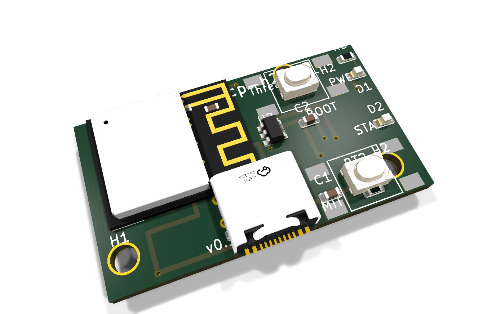
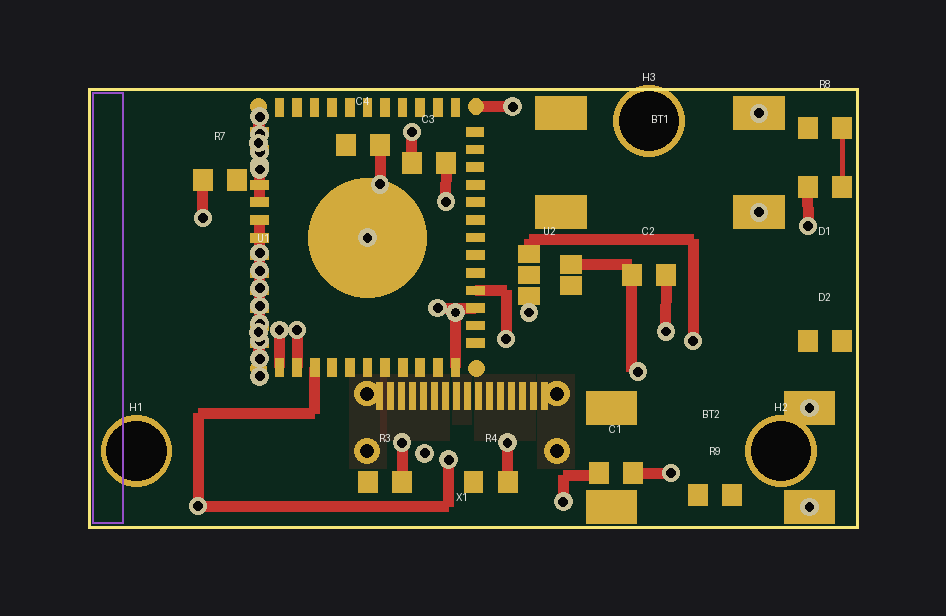
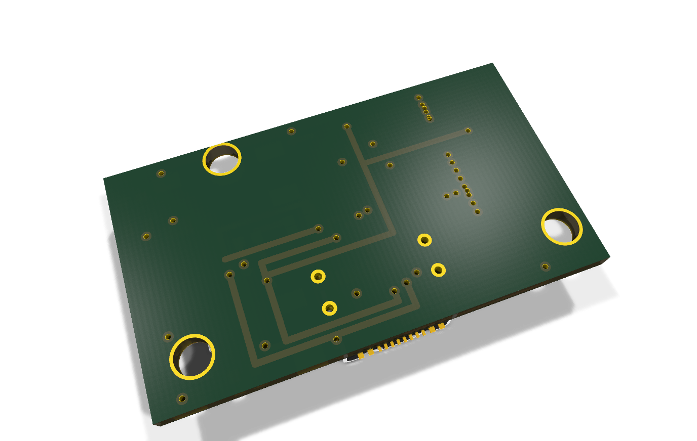
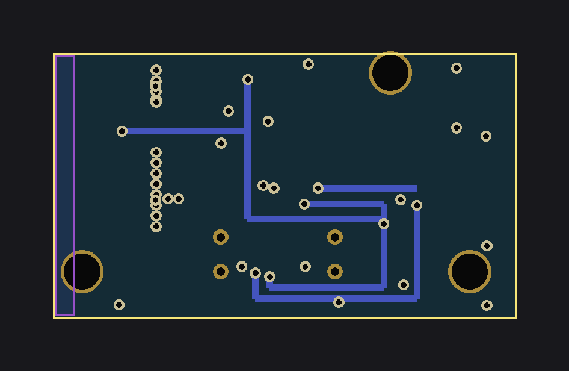

# threadrcp-h2 — Thread RCP dongle for Home Assistant OTBR (SPEC 7.6)

ESP32-H2-MINI-1 USB-C dongle acting as a **Thread Radio Co-Processor** for a
Home Assistant OpenThread Border Router. Native USB (GPIO26/27) only — no
UART bridge. **v0.1 concept board.**

- Board: 35 × 20 mm, 2-layer; module rotated 270°, antenna overhangs top edge
  (intentional — keep the dongle tip metal-free; keep-out zone marked)
- Power: USB 5 V → AP2112K-3.3 LDO
- Status: `python3 boards/wave2/wave2gen.py threadrcp-h2` → self-check OK

## BOM (bom_lcsc.csv)

| Ref | Value | Footprint | LCSC # | MPN | Qty |
|---|---|---|---|---|---|
| U1 | ESP32-H2-MINI-1 (rot 270°) | ESP32-H2-MINI-1 | C2924539 | ESP32-H2-MINI-1-N4 | 1 |
| U2 | AP2112K-3.3 | SOT-23-5 | C51118 | AP2112K-3.3TRG1 | 1 |
| X1 | USB-C 16P (bottom edge) | custom:USB-C-16P-MidMount | C165948 | TYPE-C-31-M-12 | 1 |
| BT1,BT2 | SW_PUSH (RST=EN / BOOT) | custom:Tactile-6x6-SMD | C91808 | TS-1187A-B-A-B | 2 |
| D1 | LED red (STAT) | 0603 | C2286 | 17-21SURC/S530-A3/TR8 | 1 |
| R8 | 1k (LED) | 0603 | C21190 | 0603WAF1001T5E | 1 |
| R3,R4 | 5.1k (USB CC1/CC2) | 0603 | C23186 | 0603WAF5101T5E | 2 |
| R7 | 10k (EN pull-up) | 0603 | C98252 | 0603WAF1002T5E | 1 |
| R9 | 1k (BOOT series) | 0603 | C21190 | 0603WAF1001T5E | 1 |
| C1,C2 | 10uF | 0805 | C15850 | CL21A106KPFNNNE | 2 |
| C3,C4 | 100nF | 0603 | C14663 | CL10B104KB8NNNC | 2 |

## Pinout (H2-MINI-1)

| Signal | GPIO | Notes |
|---|---|---|
| USB D- / D+ | GPIO26 / GPIO27 | H2 native USB-Serial-JTAG (RCP transport) |
| STAT_LED | GPIO8 | D1 via R8 |
| BOOT | GPIO9 | BT2 via R9; hold at reset = ROM bootloader |
| RST | EN | BT1, R7 pull-up, C4 |
| TX0 / RX0 | GPIO24 / GPIO23 | pads only (spare UART), unused for RCP |

## Firmware

**No ESPHome yaml by design** — an RCP runs no application logic:

1. Build the esp-idf `ot_rcp` example (esp-thread-br / openthread
   `ot_rcp` for ESP32-H2) with USB-Serial-JTAG transport:
   `idf.py -DIDF_TARGET=esp32h2 flash` (flash via USB-C, BOOT if needed).
2. In Home Assistant: install the **OpenThread Border Router** add-on,
   select the dongle's `/dev/ttyACM*` (USB) device; then configure the
   Thread integration to use that OTBR.
3. Alternatively flash the prebuilt `ot-rcp` binaries from the
   Home Assistant / Nabu Casa "Connect ZBT" firmware project.

## Routing status

**v0.1 concept — signals left for autorouting.** Power rails routed
(VBUS/+3V3 with B.Cu trunks + F.Cu drops, GND zones on both layers with
stitching); USB D+/D- and control signals unrouted ratsnest.

## Analyzer notes

`analyze_pcb.py`: **DFM-001 = 0**. RT-001 unrouted errors expected.
Module overhang at the antenna end is deliberate (module datasheet keeps
antenna clear of the host board); BT2 GND pads nearly touch the MH
mounting copper — joined GND by design.

## Caveats (verify before fabrication!)

- USB D+/D− must be routed as a ~90 Ω diff pair in the autorouting pass —
  short, parallel, over unbroken GND.
- H2 native USB enumerates as USB-JTAG/serial; verify host driver support
  (`cdc-acm`) in your HA OS version.
- **Verify all footprints, pin numbers, and clearances against KiCad
  libraries + datasheets before ordering boards.**

## Renders

| Raytraced 3D (KiCad) | 2D layout |
|---|---|
|  |  |
|  |  |

🎬 [360° turntable video](turntable.mp4) — 24 real KiCad raytraced frames stitched with ffmpeg (tools/turntable.sh).
